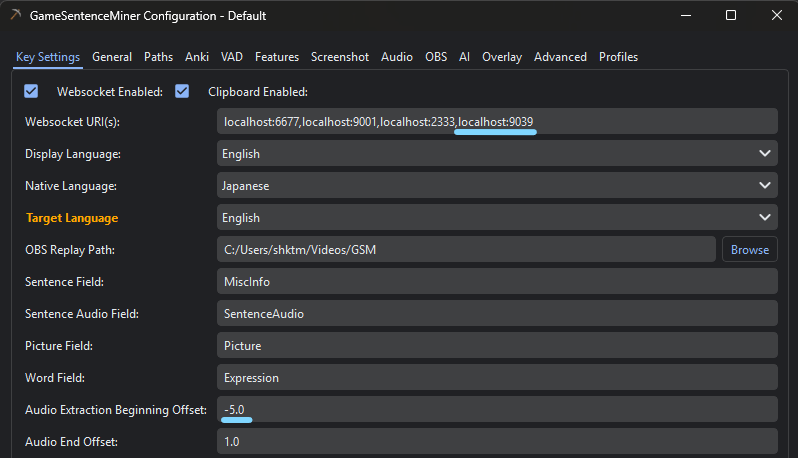

# Realtime Subtitle

A real-time speech-to-subtitle tool based on Soniox API. Captures system audio and displays live transcription and translation.
**Requires your own Soniox API Key** which costs money based on usage. See [Soniox Pricing](https://soniox.com/pricing) for details.
~~Soniox used to offer free credits.~~ Sadly they no longer do so anymore.

<div align="center">
    
</div>

## Features

- Capture audio from system default output or default microphone
- Speech recognition powered by Soniox
- Real-time translation (uses system language as target by default)
- Toggle sentence segmentation mode and source/target language display
- Send transcription results via WebSocket server, mainly for [GameSentenceMiner](https://github.com/bpwhelan/GameSentenceMiner) 

## Installation

Download the latest release from the Releases page, or install from source:

```bash
git clone https://github.com/febilly/realtime-subtitle
cd RealtimeSubtitle
pip install -r requirements.txt
```

## Configuration

Choose one of the following methods to provide your Soniox API key.

- Set the `SONIOX_API_KEY` environment variable to your API key
- Set the `SONIOX_TEMP_KEY_URL` environment variable to point to a temporary key endpoint

This program will also try to read the environment variables from a `.env` file if it exists.

### Configuration for GameSentenceMiner

This program sets up a local WebSocket server at localhost:9039. Specify this URI in the GSM settings and lower the "Audio Extraction Beginning Offset" to account for slight delays in speech recognition.



Once you set up Yomitan or similar tools in GameSentenceMiner, you can use it like in the following demo. For videos like YouTube, there's a similar extension ASB Player, but with this program, you can mine words from audio regardless of the target app.

https://github.com/user-attachments/assets/f69a15e9-a558-44a3-840c-6e87312a806d

Also, when using Texthooker WebUI, turn on the 'Merge equal Line Starts' option.

## Run

```bash
python server.py
```

Add `--debug` flag to enable debug mode.

## Build

```bash
pip install pyinstaller
python build_exe.py
```

The executable will be located at `dist/RealtimeSubtitle.exe`.

## Configuration Options

Edit `config.py` to modify:

- `USE_SYSTEM_LANGUAGE`: Whether to use system language as translation target
- `TARGET_LANG`: Manually specified target language code
- `SERVER_PORT`: Local WebUI server port (falls back to system-assigned port if unavailable)
